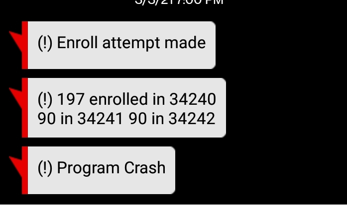

# Class Registration Web Scraper

This is a simple Python script that uses Selenium to scrape specified information from the registrar office's website at the University of California--Irvine.
The information is used to determine if a seat has opened in a specified course and automatically enrolls the user if true. 
  
## Background
One of the supposed benefits to a university being on the quarter system is that it allows more opportunities for classes to be offered throughout the year (i.e. 3-4 times instead of 2 with semesters).
However, this often creates the case where classes fill quickly and many students cannot register. If the class is a prerequisite for another, this can complicate a student's program and even delay their graduation. 
This registration web scraper was developed in this exact circumstance. 

Although a class may be full, it is certain that a handful of students will sporadically drop the course between registration and the beginning of instruction. However, these drops can happen at random times and very infrequently. 
Therefore, one must be incredibly lucky or constantly check the registrar themselves, which is not feasible. 

This script was ultimately successful in enrolling me in an important course.

## Process
Using Selenium, the script runs 24/7 on a separate machine. Every 2 seconds a request is made to the registrar's website to load their page and analyze the enrollment level of a certain course. If a seat has opened, 
the script logs into the student's registration account and registers them for the desired class and discussion section. If an enrollment attempt is made, a text message is sent to the student notifying them of the attempt 
along with the enrollment numbers received. A text message notification is also sent if the script crashes at any point throughout the day. 

